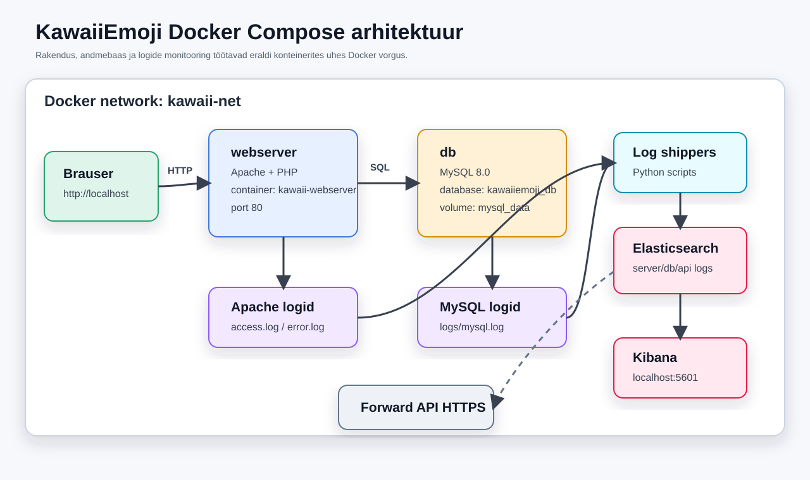

# KawaiiEmoji: Konteineriseeritud Infrastruktuur

Lühem Google Slides'i esitluse versioon.  
Soovituslik pikkus: 20-30 minutit.  
Formaat: iga `Slide` on eraldi slaid. `Rääkija märkmed` on abiks esinemisel, neid ei pea slaidile panema.

---

## Slide 1: Tiitelslaid ja Liftikõne

# KawaiiEmoji
## Konteineriseeritud veebirakendus emoji-kogukondadele

**Probleem:** tekstipõhiseid kawaii/anime emotikone on ebamugav otsida, hoida ja jagada.  
**Lahendus:** KawaiiEmoji on veebirakendus, kus kasutaja saab emotikone sirvida, otsida, kopeerida, laikida ja ise juurde lisada.

Tiim: Hussein, Timur, Maksim, Nikita L

**Räägib:** CEO / Tiimijuht

**Rääkija märkmed:**
Tere! Meie projekt on KawaiiEmoji. See on nagu väike sotsiaalne raamatukogu tekstiemojidele. Kasutaja leiab kiiresti armsa, naljaka või anime-stiilis emotikoni, kopeerib selle ühe klikiga ja saab seda kasutada Discordis, Slackis või mujal. Tehniliselt on projekt üles ehitatud konteineriseeritud infrastruktuurina: rakendus, andmebaas, veebiserver, logid ja monitooring töötavad Docker Compose keskkonnas.

---

## Slide 2: Kasutaja ja Väärtus

# Kellele see on mõeldud?

- Discordi, Slacki ja foorumite kasutajatele
- Anime ja kawaii stiili fännidele
- Sisuloojatele ja kogukondadele
- Kasutajatele, kes tahavad enda emotikone jagada

# Miks seda kasutada?

- Kiire otsing ja kategooriad
- Copy ühe klikiga
- Kasutajakonto ja anonüümne lisamine
- Like'id ja download-count näitavad populaarsust

**Räägib:** CEO / Tiimijuht

**Rääkija märkmed:**
Kasutaja jaoks on väärtus lihtsus. Ta ei näe Dockeri võrke ega andmebaasi. Tema näeb ilusat galeriid, valib sobiva emoji ja saab selle kohe kasutada. Samal ajal on taustal päris andmebaas, API ja logimine.

---

## Slide 3: Tiim ja Rollid

# Kes mida tegi?

| Roll | Liige | Vastutus |
|---|---|---|
| CEO / Tiimijuht | Hussein | suhtlus, koordineerimine, testimine, demo |
| DB Admin | Timur | MySQL konteiner, skeem, DB logid |
| Webserver Admin | Maksim | Apache/PHP, port mapping, access/error logid |
| App Developer | Nikita L, Maksim | PHP rakendus, UI, API |
| DevOps / Monitoring | Timur | Docker Compose, võrgud, Kibana/Elasticsearch |

**Räägib:** CEO või kogu tiim kordamööda

**Rääkija märkmed:**
Rollid jagasime nii, et igal liikmel oleks selge vastutus. Projektis oli korraga vaja rakendust, andmebaasi, veebiserverit ja monitooringut, seega rollijaotus aitas vältida segadust. Samas pidid kõik osad lõpuks koos töötama.

---

## Slide 4: Süsteemi Arhitektuur

# Suur pilt

Lisa Google Slides'i arhitektuurijoonis:

`assets/docs/kawaiiemoji-architecture.svg`



**Päringu teekond:**

1. Brauser avab `http://localhost`
2. Päring jõuab Apache/PHP konteinerisse
3. PHP küsib andmeid MySQL teenuselt `db`
4. MySQL tagastab emoji/kasutaja andmed
5. Rakendus saadab HTML või JSON vastuse tagasi brauserisse

**Räägivad:** Adminid

**Rääkija märkmed:**
Konteinerid suhtlevad omavahel Docker Compose võrgu kaudu. Rakendus ei kasuta andmebaasi jaoks `localhost`, vaid teenusenime `db`. See on üks tähtis konteinerite põhimõte: iga teenus on eraldi, aga nad on samas sisemises võrgus.

---

## Slide 5: Docker ja Teenused

# Mida Docker Compose käivitab?

| Teenus | Roll |
|---|---|
| `webserver` | Apache + PHP, teenindab rakendust |
| `db` | MySQL 8.0, hoiab kasutajaid ja emojisid |
| `elasticsearch` | kogub ja indekseerib logisid |
| `kibana` | visualiseerib logisid dashboardil |
| `apache-log-shipper` | saadab Apache logid Elasticsearchi |
| `mysql-log-shipper` | saadab MySQL logid Elasticsearchi |

Käivitus:

```bash
docker compose up -d
```

**Räägib:** Webserver Admin / DevOps

**Rääkija märkmed:**
Docker aitas teha keskkonna korratavaks. Kõik tiimiliikmed saavad käivitada sama süsteemi ühe käsuga. Volume'id hoiavad andmeid ja logisid, `kawaii-net` ühendab teenused ning konteinerid eraldavad Apache, MySQL ja monitooringu üksteisest.

---

## Slide 6: Andmebaas ja Rakendus

# MySQL andmemudel

Põhitabelid:

- `users` - kasutajakontod
- `emoji_categories` - kategooriad
- `emojis` - emoji sümbol, nimi, kategooria, tagid, like'id, downloadid
- `emoji_likes` - kasutaja ja emoji vaheline like-seos

# Rakenduse funktsioonid

- Emoji gallery, otsing ja kategooriad
- Login/register
- Uue emoji lisamine
- Like ja copy
- Profiilivaade
- API endpointid: `/api/search.php`, `/api/auth.php`, `/api/emojis.php`, `/api/profile.php`

**Räägivad:** DB Admin + Arendaja

**Rääkija märkmed:**
Andmebaas ei ole ainult taustal olev demo. Kui kasutaja lisab emoji, tehakse päriselt `INSERT` tabelisse `emojis`. Kui ta vajutab like, muutub `emoji_likes` ja like-count. Kui ta copyb emoji, suureneb download-count.

---

## Slide 7: Logimine ja Monitooring

# Kuidas süsteemi tervist jälgime?

| Logiallikas | Fail või indeks |
|---|---|
| Apache access log | `logs/apache_access.log` |
| Apache error log | `logs/apache_error.log` |
| MySQL general log | `logs/mysql.log` |
| API structured logid | Elasticsearch `api-logs` |
| Apache indeks | Elasticsearch `server-logs` |
| MySQL indeks | Elasticsearch `db-logs` |

Lisa log-flow joonis:

`assets/docs/kawaiiemoji-log-flow.svg`

**Räägib:** DevOps / Monitoring

**Rääkija märkmed:**
Apache ja MySQL kirjutavad logid failidesse. Logi-shipperid loevad neid faile ja saadavad read Elasticsearchi. API-l on eraldi `logger.php`, mis saadab struktureeritud sündmusi otse Elasticsearchi. Kibanas näeme neid kõiki ühes kohas.

---

## Slide 8: Kibana Dashboard

# Mida Kibana näitab?

- Logisõnumite koguarv
- Logitasemete jaotus: `INFO`, `WARNING`, `ERROR`
- Logid teenuse kaupa: webserver, database, api
- HTTP staatused ja Apache päringud
- MySQL tegevused
- API endpointid ja validation/database vead

**Demo eesmärk:** teeme rakenduses tegevuse ja näitame, et vastav logi ilmub Kibanas.

**Räägib:** DevOps / Monitoring

**Rääkija märkmed:**
Kibana on administraatori vaade. Selle asemel, et avada igat logifaili eraldi, saab dashboardilt kiiresti aru, kas süsteem töötab ja kus vead tekivad. See on päris projektides väga oluline.

---

## Slide 9: Live Demo Plaan

# Näitame, et asi päriselt töötab

1. `docker compose ps` - konteinerid töötavad
2. `http://localhost` - rakendus avaneb
3. Gallery, otsing ja kategooriad
4. Login/register
5. Uue testemoji lisamine
6. Emoji ilmub galeriis andmebaasist
7. API päringu näitamine brauseris või Network tabis
8. Kibana avamine: `http://localhost:5601`
9. Vea või päringu tekitamine
10. Uue logikirje näitamine dashboardil

**Räägivad:** Arendaja + kogu tiim

**Rääkija märkmed:**
Demo peab näitama kogu ahelat: brauser, Apache/PHP, MySQL ja logid. Kui live demo ei tööta, on hea hoida varuks screenshots või lühike video, aga esmalt proovime näidata päris töötavat keskkonda.

---

## Slide 10: Tavakasutaja Demo

# Mida kasutaja näeb?

- Avaleht ja emoji gallery
- Kategooriad: Kawaii, Anime, Funny, Sad, Love, Angry, Animals
- Otsing nime või tagide järgi
- Copy nupp ja download-count
- Login/register
- Upload vorm:
  - sümbol
  - nimi
  - kategooria
  - tagid
  - kirjeldus
  - anonymous checkbox

**Räägib:** Arendaja

**Rääkija märkmed:**
Siin näitame kasutaja väärtust. Uue emoji lisamine tõestab, et vorm suhtleb API-ga ja API suhtleb andmebaasiga. Kui uus kirje ilmub galeriis, on näha, et andmed ei ole staatilised.

---

## Slide 11: Admin Demo

# Mida administraator kontrollib?

Konteinerid:

```bash
docker compose ps
```

Logifailid:

```bash
tail -f logs/apache_access.log
tail -f logs/apache_error.log
tail -f logs/mysql.log
```

Kibana:

```text
http://localhost:5601
```

Vea tekitamine:

```text
http://localhost/missing-page.php
```

**Räägivad:** Webserver Admin / DevOps

**Rääkija märkmed:**
Administraatori demo fookus on süsteemi tervisel. Näitame, et konteinerid on üleval, logid tekivad hosti `logs/` kausta ja Kibana saab neid kasutada. 404 vea tekitamine on lihtne viis näidata reaalajas logimist.

---

## Slide 12: Protsess ja Raskused

# Kuidas töötasime?

- Hübriidne agiilne lähenemine sprintidega
- Sprint 0: tiim ja rollid
- Sprint 1: projekti kirjeldus ja arhitektuur
- Sprint 2: Docker, Apache, MySQL, logid
- Sprint 3: PHP rakendus ja DB ühendus
- Sprint 4: demo, testimine, Kibana

# Mis oli raske?

- Docker võrk ja teenusenimed
- MySQL `utf8mb4`, et emotikonid töötaksid
- Volume mountid logifailidele
- Elasticsearchi ja Kibana ühendamine
- Live demo stabiilsena hoidmine

**Räägivad:** Kõik liikmed

**Rääkija märkmed:**
Kõige suurem õppetund oli see, et konteinerid teevad keskkonna korratavaks, aga lisavad ka uue loogika: võrgud, volume'id ja teenuste sõltuvused. Probleeme lahendasime kihthaaval: kõigepealt konteiner, siis võrk, siis andmebaas, siis rakendus, siis logid.

---

## Slide 13: Tulevik ja Ärimudel

# Kas sellest võiks saada SaaS?

Jah. Võimalikud mudelid:

- Tasuta avalik gallery
- Premium kontod rohkemate uploadide ja privaatsete kogudega
- Workspace'id Discordi või kogukondade jaoks
- Bränditud emoji library kogukondadele

# Milleks küsiksime investeeringut?

- Pilveinfrastruktuur ja backupid
- Turvalisem autentimine
- Uued arendajad ja UI/UX
- Turundus anime ja creator-kogukondades
- AI-põhine emoji soovitus või generator

**Räägib:** CEO / Tiimijuht

**Rääkija märkmed:**
Tootel on nišš: kogukonnad kasutavad palju sisemist keelt ja sümboleid. Kui anda neile lihtne koht nende kogumiseks, jagamiseks ja haldamiseks, saab sellest teha freemium või B2B teenuse.

---

## Slide 14: Tehniline Tulevik

# Järgmise 6 kuu plaan

- OpenAPI/Swagger dokumentatsioon meie enda API-le
- Automatiseeritud testid
- CI/CD pipeline
- Pilvepõhine deployment
- Parem õiguste süsteem adminidele
- Emoji packid ja kollektsioonid
- Moderatsioon ja report nupp
- Kibana alertid, näiteks palju 500 vigu 5 minuti jooksul

**Räägivad:** CEO / DevOps / Arendaja

**Rääkija märkmed:**
Kõige realistlikumad järgmised sammud on Swagger dokumentatsioon, testid ja deployment. Kui süsteem liigub päris kasutajateni, muutuvad oluliseks turvalisus, moderatsioon ja alerting.

---

## Slide 15: Kokkuvõte ja Q&A

# Mida valmis tegime?

- Töötav KawaiiEmoji veebirakendus
- Apache/PHP rakendus Docker konteineris
- MySQL andmebaas skeemi ja seed-andmetega
- Docker Compose infrastruktuur
- Logid hosti `logs/` kaustas
- Elasticsearch + Kibana monitooring
- Apache/MySQL logi-shipperid
- Struktureeritud API logimine

# Küsimused?

**Räägivad:** Kõik

**Rääkija märkmed:**
Kokkuvõttes tegime mitte ainult veebilehe, vaid tervikliku süsteemi: rakendus, andmebaas, konteinerid, logid ja dashboard. Küsimustele vastame rollide järgi: DB küsimused Timur, veebiserver Maksim, rakendus Nikita L/Maksim, äripool Hussein.

---

# Demo Cheat Sheet

Seda osa ei pea slaididele panema.

## Enne demo algust

```bash
docker compose up -d
docker compose ps
```

Kontrolli:

- `http://localhost`
- `http://localhost:5601`
- `logs/apache_access.log`
- `logs/apache_error.log`
- `logs/mysql.log`

## Kiire DB kontroll

```bash
docker compose exec db mysql -u kawaii_app -papp_password_123 kawaiiemoji_db -e "SELECT id, name, category, downloads, likes FROM emojis;"
```

## Kiire logi kontroll

```bash
tail -f logs/apache_access.log
tail -f logs/apache_error.log
tail -f logs/mysql.log
```

## Vea tekitamine

```text
http://localhost/missing-page.php
```

Või login vale parooliga.

---

# Kõneaja Jaotus

Soovitus 25-minutiliseks esitluseks:

| Osa | Aeg |
|---|---:|
| Pitch, kasutaja ja tiim | 4 min |
| Arhitektuur, Docker, andmebaas | 7 min |
| Logimine ja Kibana | 4 min |
| Live demo | 7-9 min |
| Protsess, raskused, tulevik | 4 min |
| Q&A | 3-5 min |

---

# Rollide Jaotus

| Liige | Slaidid / teemad |
|---|---|
| Hussein | 1-3, 13-15 |
| Timur | 6-8, 11 |
| Maksim | 4-5, 9, 11 |
| Nikita L | 6, 9-10 |
